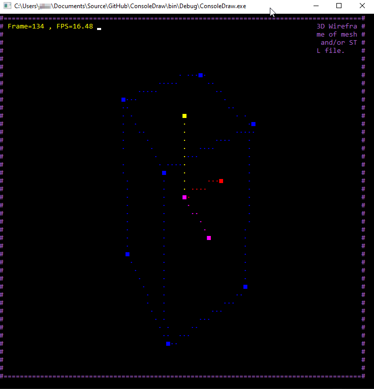

# ConsoleDraw
 Draws a 3D wireframe on the console window and rotates it.

 ## Screenshot

 

 ## Code

 There are two technologies employed to draw on the console.

  - Use of `Console.SetCursorPosition()` and `Console.Write()` to draw characters in `CRender`. This is used to draw all 3D objects. Each object is drawn separately (one at a time) using a sequence of set cursor, set color and write methods.

  - Use of a character buffer in `CBuffer` to draw an entire window with one `Console.Write()` command. This method uses the commands in `AnsiCodes` to enable terminal processing in a `Console` window for processing color codes as well as cursor position codes. 
    - Use `.AddText()` to add text to the console buffer and it will render a text string in a rectangular area like seen in  the screen-shot above in the top right corner.
    - For example all sequential spaces are replaced with a single _move cursor X places forward_ ANSI command. For example 20 spaces become `"\u001B]20B"` where the `20` is the distance and `B` is the move forwards code.

## STL file processing

There is simple parser for binary STL files which reads in the geometry and fill in a `Mesh3` object which contains vertices and edges. A `Scene` contains all the `Shape` and `Mesh3` objects to be diplayed. You can add built in shape, or read an **STL** file with `scene.AddShape(new StlMesh3())`.

